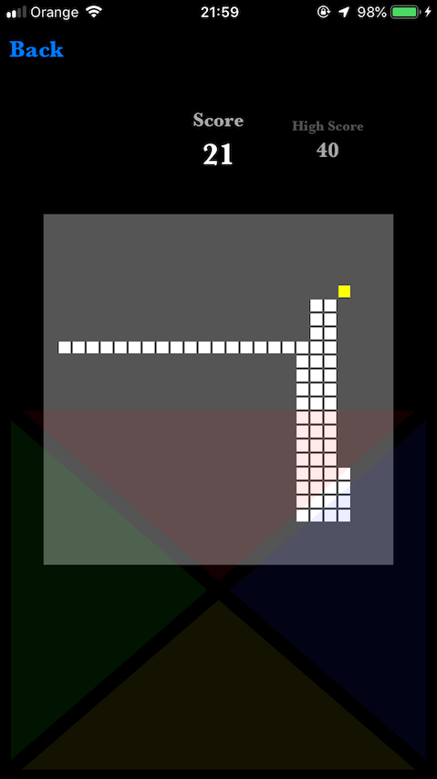

# Original-Snake
Original snake game for iOS written in Swift 4.2

## Description
### General
This is my first game made without any game engine but using only simple UIViews. I've decided to write it, because on App Store there is no snake game with responsive steering method (I don't like swiping left and right for arcade games), so in my version I've put buttons to move snake in all directions. 

### Technical
I didn't start writting code with TDD but later I decided to add tests, because it was the easiest way to test some functions.

## Gameplay
At the beginning we have three-square long snake. Our goal is to fill the gameboard with the snake. It's very difficult to reach this state (only for hardcore gamer) but our first goal in the game is to learn about how to change directions of snake's movement.

I'm trying to make it simple, responsive and intuitive but also comfortable for this type of games. So there are buttons.

After mastering the movement, it's your turn to reach the best highscore!
Best of luck!
